# 01 — Individual Problem Scan

## Scan rộng

| # | Lăng kính | Problem quan sát được | Ai đang đau? | Dấu hiệu thật |
|---|---|---|---|---|
| 1 | Lặp lại, tốn thời gian | phải sắp xếp thời gian và check mail để check deadline vào mỗi buổi sáng, quản lý và đặt các báo hẹn hoặc nhắc nhở cho các công việc | Mọi người | Mất khoảng 30 - 45 phút mỗi ngày |
| 2 | Lặp lại, tốn thời gian | Kiểm tra tiếng độ của từng bản kanban của từng sinh viên khi đang trong final project | Giảng Viên | Lặp lại mỗi tuần |
| 3 | Tốn thời gian | Thống kê các thông báo, check các case của học sinh, check status của các khoảng thu của từng học sinh | Giáo Viên | 15 phút/bản |
| 4 | Tốn thời gian | Kiểm tra tiến độ của từng sprint, tìm kiếm lại code cũ, các bản documentation cũ khi ở trong github khi phải fix bug hoặc tìm kiếm giải pháp | PM, team member | 30 phút/lần |
| 5 | AI có thể tốt hơn | Kiểm tra đánh giá các đơn hàng mới, ví dụ 4 sao tại sao , 3 sao tại sao, tổng hợp lại và báo cáo| Sale| Task nhiều nhưng việc đọc và kiểm tra từng comment và phải tự thống kê lại quá tốn thời gian|
| 6 | AI có thể tốt hơn | Tìm kiếm lại các bài DSA tương đồng, trong DSA có thể cùng một bài nhưng được revise lại trên một web khác, hoặc trong thi cần tìm lại các đoạn code để cho cheat sheet | Cả team | 20-25 phút/lần tìm |
| 7 | AI có thể làm tốt hơn | Mỗi lần code xong một function mà muốn test lại thuật toán thì thường phải viết lại test script, liệu có cách nào để có một extension dùng trực tiếp trong IDE để có thể (đoán được input , chạy thử function như leetcode và evaluate (auto viết code sinh test + thêm user để ))| Cả team | 20-25 phút/lần tìm |

## Top 3

| Rank | Problem | Vì sao chọn | Điều còn chưa chắc |
|---|---|---|---|
| 1 | Kiểm tra đánh giá các đơn hàng mới, ví dụ 4 sao tại sao , 3 sao tại sao, tổng hợp lại và báo cáo | Nhiều người đau, impact rộng | Dữ liệu review lấy từ đâu (Shopee, Lazada, web nội bộ)? Tần suất làm báo cáo là daily, weekly hay monthly? Sau khi có báo cáo thì action tiếp theo là gì, hay chỉ "đọc cho biết"? Nếu report không dẫn đến action, quy trình này không sinh ra giá trị.|
| 2 | Tổng hợp và sắp xếp thời gian | Workflow rõ, mất nhiều thời gian, có metric tốt về phần TSC(Task success  rate), metrics của voice | Thế nào là một sản phẩm có UX đủ tốt và có security đủ tốt |
| 3 | Tìm kiếm lại các bài DSA tương đồng scope to hơn là tìm các code được note lại | Có pain thật, AI có thể giúp đọc/tóm tắt tổng hợp và dễ dàng lưu lại , truy xuất | Làm sao để hiểu được cấu trúc search code tốt hơn (mỗi loại code có syntax khác nhau) |

## Problem Card #1 — Sentiment Analysis & Review Report

**Problem 1 câu:**  
Nhân viên Quality Analytics (QA) mất quá nhiều thời gian (nửa ngày) để đọc thủ công, gán nhãn hàng ngàn review 1-4 sao, khiến báo cáo chất lượng gửi Store Manager bị chậm, dễ sai sót do cảm tính và khó scale khi lượng đơn hàng tăng vọt.

**Actor:**  
*   **Doer:** Quality Analytics (QA) - người tổng hợp và phân tích.
*   **Stakeholder:** Store Manager - người đọc report để ra quyết định cải thiện vận hành.

**Thời điểm / bối cảnh:**  
Cuối mỗi tuần hoặc sau các chiến dịch Mega Sale (khi lượng review tăng đột biến).

**Điều còn chưa chắc (Cập nhật lại):**  
*   Làm sao để đảm bảo LLM không "bịa" (hallucinate) ra lý do phàn nàn không có thật?
*   Độ chính xác (Accuracy) của LLM khi gặp từ lóng, viết tắt, hoặc comment mang tính mỉa mai (sarcasm) của khách hàng.
*   Store Manager có thực sự tin tưởng vào insight do AI tổng hợp để ra quyết định thay đổi vận hành (ví dụ: đổi đối tác giao hàng, phạt nhân viên đóng gói) hay không?

**Current workflow:**
1. Export dữ liệu đánh giá từ các sàn TMĐT về Excel.
2. Filter các đánh giá từ 1 đến 4 sao.
3. Đọc thủ công từng comment để phân tích.
4. Gán nhãn thủ công (Tagging) từng dòng trên Excel.
5. Thống kê số liệu, vẽ biểu đồ.
6. Viết narrative báo cáo tổng hợp.
7. Gửi báo cáo cho Store Manager.

**Bottleneck:**  
Bước 3 & 4 — Đọc thủ công và gán nhãn tốn nhiều sức lực nhất, giới hạn khối lượng data có thể xử lý và phụ thuộc vào cảm tính của người đọc.

**Impact:**  
Mất 3-4 tiếng/tuần cho 1 bản báo cáo. Khi có Mega Sale, QA bị "ngập" trong data dẫn đến báo cáo trễ, Store Manager không có insight kịp thời.

**Success metric:**  
*   Giảm thời gian xử lý data và làm báo cáo từ 4 tiếng xuống dưới 45 phút.
*   Độ chính xác khi tự động gán nhãn của AI đạt trên 85% so với human.

**Non-AI alternative:**  
Chỉ dùng Rule-based (tìm kiếm keyword) + Dashboard Excel. *Hạn chế:* Bỏ sót nhiều context phức tạp, không xử lý được lỗi chính tả, không draft được narrative, không hiểu được sâu về ngữ cảnh, các câu cảm thán mỉa mai(sarcasm), khó scale khi lượng order tăng đột biến.

**AI hypothesis:**  
Sử dụng **LLM Workflow kết hợp Rule-based**. Rule-based lọc rác. LLM trích xuất insight và draft narrative. QA đóng vai trò Reviewer (Human-in-the-loop).

**Quick gut:**  
LLM Workflow / Data Pipeline.

### Workflow Comparison

```mermaid
graph TD
    subgraph Current State - 240 phút
        A[1. Export review] --> B[2. Filter 1-4 sao]
        B --> C[3. Đọc thủ công hàng ngàn comment]:::bottleneck
        C --> D[4. Gán nhãn Excel thủ công]:::bottleneck
        D --> E[5. Vẽ biểu đồ & thống kê]
        E --> F[6. Tự viết narrative]
        F --> G[7. Gửi Store Manager]
    end

    subgraph Future State - 45 phút
        H[1. Data Ingestion/Export] --> I[2. Rule-based: Lọc Spam/Ngắn]
        I --> J[3. LLM: Auto-Tagging & Extract Aspect]:::ai
        J --> K[4. Hệ thống: Aggregate Data]
        K --> L[5. LLM: Draft Narrative Report]:::ai
        L --> M[6. QA Review & Edit]:::human
        M --> N[7. Gửi Store Manager]
    end

    classDef bottleneck fill:#ffcccc,stroke:#ff0000,stroke-width:2px;
    classDef ai fill:#e1f5fe,stroke:#03a9f4,stroke-width:2px;
    classDef human fill:#fff3e0,stroke:#ff9800,stroke-width:2px;
```

